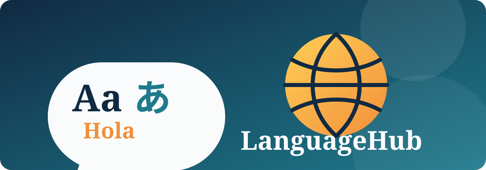

# LanguageHub

<p align="center">
	
</p>

LanguageHub is a collaborative web project for building an easy and engaging online language-learning experience. The project is inspired by services such as Duolingo and is intended to help learners practise languages through simple, accessible lessons and interactive learning activities.

This repository currently contains the initial static HTML prototype. It provides a starting point for the team to design and implement the future LanguageHub learning platform.

## Project Goals

- Make language learning approachable for beginners.
- Present learning content in a clear and friendly interface.
- Support consistent practice through structured learning activities.
- Create a foundation that can later be extended with progress tracking, quizzes, pronunciation practice, and user accounts.
- Build the project collaboratively using Git and GitHub.

## Current Features

The current version is an early prototype and includes:

- A main LanguageHub landing page.
- Separate HTML pages created by individual team members.
- Basic page metadata and semantic HTML structure.
- A zero-dependency setup that can be opened directly in a web browser.

The learning system and interactive functionality are planned for future development.

## Repository Structure

| File | Description |
| --- | --- |
| `index.html` | Main LanguageHub entry page. |
| `gayantha_index.html` | Contributor prototype page by Gayantha. |
| `laknaindex.html` | Contributor prototype page by Lakna. |
| `shehanindex.html` | Contributor prototype page by Shehan. |
| `assets/languagehub-banner.svg` | Project banner displayed in this README. |
| `README.md` | Project documentation and team information. |

## Getting Started

### Prerequisites

No build tools, package managers, or external dependencies are required for the current prototype. You only need:

- A modern web browser such as Chrome, Edge, Firefox, or Safari.
- Git, if you want to clone or contribute to the repository.

### Run Locally

1. Clone the repository:

	```bash
	git clone <repository-url>
	```

2. Open the project directory:

	```bash
	cd HICT-22013-LanguageHub
	```

3. Open `index.html` in your browser.

For a local development server, run the following command from the project directory if Python is installed:

```bash
python -m http.server 8000
```

Then visit [http://localhost:8000](http://localhost:8000) in your browser.

## Planned Improvements

The following capabilities can be added as the project grows:

- Language selection and learner onboarding.
- Beginner, intermediate, and advanced learning paths.
- Vocabulary, grammar, reading, listening, and speaking exercises.
- Interactive quizzes with immediate feedback.
- Learner profiles and progress tracking.
- Daily goals, streaks, badges, and achievement milestones.
- Responsive design for desktop, tablet, and mobile devices.
- Accessibility improvements and support for keyboard navigation.
- A backend for authentication, course content, and learner data.

## Contributing

Contributions are welcome from all team members. A typical contribution workflow is:

1. Pull the latest changes from the main branch.
2. Create a descriptive feature branch.
3. Make focused changes and keep the existing HTML structure valid.
4. Test the updated pages in a browser.
5. Commit the changes with a clear message.
6. Push the branch and open a pull request for review.

Please keep each change focused, use meaningful filenames, and update this README when the project setup or available features change.

## Team

### Team Spako

| Index Number | GitHub Username |
| --- | --- |
| HICT 2022-32 | [lahiru3726](https://github.com/lahiru3726) |
| HICT 2022-14 | [shehanpramuad-bot](https://github.com/shehanpramuad-bot) |
| HICT 2022-31 | [lakna-pratheeshwara](https://github.com/lakna-pratheeshwara) |
| HICT 2021-21 | [nadunnwijekoon](https://github.com/nadunnwijekoon) |
| HICT 2022-17 | [GayanthaHashan](https://github.com/GayanthaHashan) |

## Project Status

LanguageHub is currently in the prototype stage. The repository is being used to establish the initial page structure and coordinate team development before the full learning experience is implemented.
